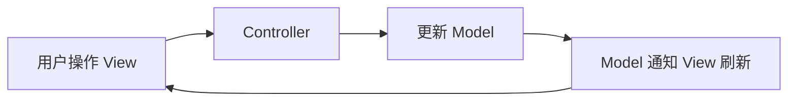
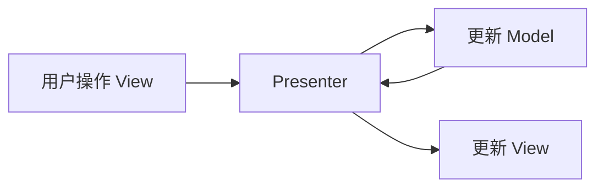
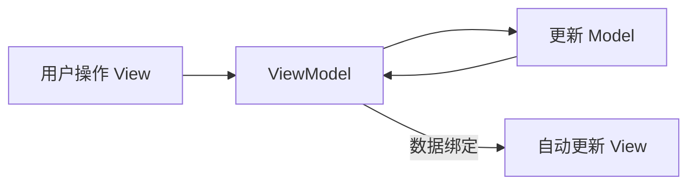

# 简介

Model–View–ViewModel(MVVM) 是一个软件架构设计模式，由微软 WPF 和 Silverlight 的架构师 Ken Cooper 和 Ted Peters 开发，是一种简化用户界面的事件驱动编程方式。由 John Gossman（同样也是 WPF 和 Silverlight 的架构师）于2005年在他的博客上发表。MVVM 源自于经典的 Model–View–Controller（MVC）模式（期间还演化出了 Model-View-Presenter（MVP）模式，可忽略不计）。MVVM 的出现促进了 GUI 前端开发与后端业务逻辑的分离，极大地提高了前端开发效率。MVVM 的核心是 ViewModel 层，它就像是一个中转站（value converter），负责转换 Model 中的数据对象来让数据变得更容易管理和使用，该层向上与视图层进行双向数据绑定，向下与 Model 层通过接口请求进行数据交互，起呈上启下作用。如下图所示：


# 个人理解

- view：页面元素
- model：数据层（包括不限于后台元素）
- viewModel：视图模型层

下面重点说明视图模型层，因为我们希望在更新后台数据的时候更新“页面元素”，并且我们希望这一过程完全解耦。解耦的好处有利于研发人员角色分离，前端研发工程师可以专注于视图模型层，而不是对业务逻辑编程。视图模型，顾名思义就是对视图建立模型，视图模型中包含对视图的完整抽象，通过视图模型可以实现对页面元素控制也可以实现更新模型层数据。

有了 viewModel，数据层的变化可以影响到页面，页面的变化也可以更新模型数据。从这里不难看出，MVVM的数据流向是双向的。

# 对比 MVC

MVC（Model-View-Controller）和MVVM（Model-View-ViewModel）是两种广泛应用的软件架构模式，核心目标均为解耦业务逻辑与界面展示，但设计理念和适用场景存在显著差异。以下是深度对比分析：

|         **组件**         |              **MVC**               |                  **MVVM**                   |
| :----------------------: | :--------------------------------: | :-----------------------------------------: |
|        **Model**         | 管理数据和业务逻辑（如数据库操作） |          同MVC，负责数据和业务规则          |
|         **View**         |   展示数据并接收用户输入（UI层）   |     仅负责UI渲染，通过数据绑定自动更新      |
| **Controller/ViewModel** | 接收用户请求，协调Model和View更新  | 作为View和Model的桥梁，处理视图逻辑和数据绑 |

> **关键区别**：
>
> - MVC的Controller需手动同步View和Model（例如调用）
>
>   ```
>   view.update()
>   ```
>
> - MVVM通过数据绑定机制实现View和ViewModel的自动同步，减少样板代码

|   **维度**   |                           **MVC**                            |                           **MVVM**                           |
| :----------: | :----------------------------------------------------------: | :----------------------------------------------------------: |
|   **优点**   |        ▶ 结构简单，适合传统Web应用<br>▶ 职责分离明确         | ▶ 开发效率高（减少手动同步代码）<br>▶ 视图与业务逻辑彻底解耦<br>▶ 单元测试更便捷（ViewModel可独立测试） |
|   **缺点**   | ▶ Controller易臃肿（复杂逻辑堆积）<br>▶ View与Model未完全解耦 | ▶ 学习曲线陡峭（需掌握数据绑定框架）<br>▶ 滥用绑定可能导致性能问题（如频繁DOM更新） |
| **调试难度** |               相对简单（逻辑集中于Controller）               |         数据流追踪复杂（需工具辅助，如Vue Devtools）         |

MVC是典型的单项数据流，而MVVM是双向数据流；

下面是 MVC 的流程图，view的事件处理绑定给 controller，controller接收请求后告诉 model 数据变化，并调用 view 层更新；


# MVC/MVP/MVVM

|            **架构模式**            |                         **核心组件**                         |                         **组件职责**                         |          **耦合度**           |
| :--------------------------------: | :----------------------------------------------------------: | :----------------------------------------------------------: | :---------------------------: |
| **MVC**<br>(Model-View-Controller) | **Model**：管理数据与业务逻辑<br>**View**：UI 渲染与用户输入<br>**Controller**：协调 Model 和 View | View 接收用户输入 → Controller 更新 Model → Model 通知 View 刷新 | 中等（View 可直接访问 Model） |
| **MVP**<br>(Model-View-Presenter)  | **Model**：数据与业务逻辑<br>**View**：被动 UI 渲染<br>**Presenter**：处理交互逻辑 | View 委托 Presenter → Presenter 操作 Model → Presenter 更新 View | 低（View 与 Model 完全隔离）  |
| **MVVM**<br>(Model-View-ViewModel) | **Model**：数据与业务逻辑<br>**View**：声明式 UI<br>**ViewModel**：数据绑定与状态管理 | View 通过绑定同步 ViewModel → ViewModel 操作 Model → 数据变更自动更新 View |     极低（双向数据绑定）      |

## mvc



## mvp



## mvvm

这样看来 mvp 和 mvvm 就非常相似了， 区别就是 mvvm 会自动更新 view 而 mvp 是手动更新



